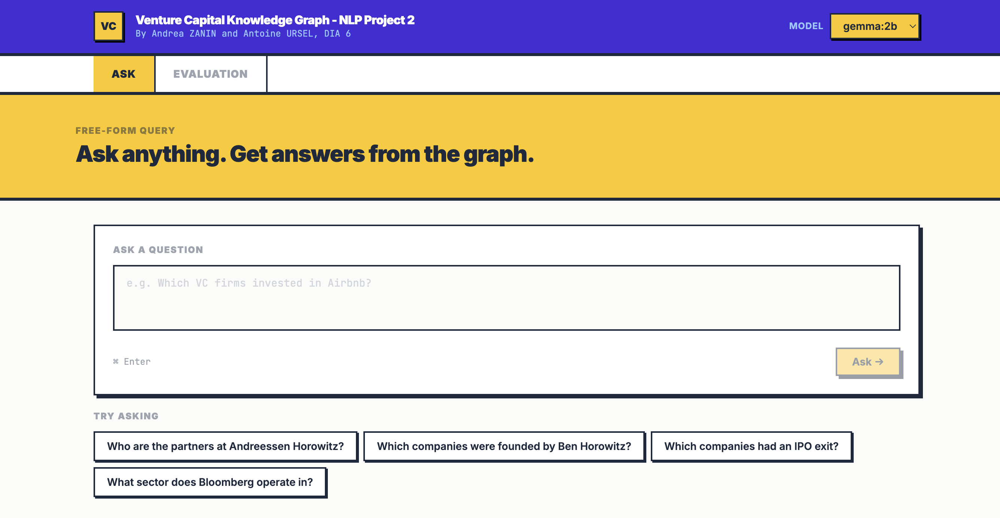
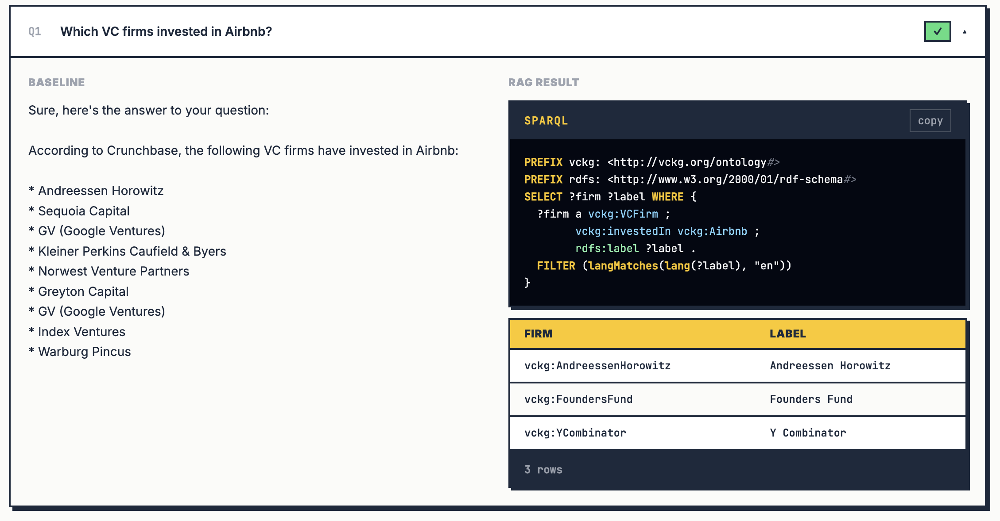

# Venture Capital Knowledge Graph



End-to-end NLP pipeline that builds a domain-specific knowledge graph for the Silicon Valley venture capital ecosystem, trains knowledge graph embeddings, applies SWRL reasoning, and serves a RAG-over-SPARQL question-answering interface.

**Authors:** Andrea ZANIN · Antoine URSEL — DIA 6, NLP Project 2

---

## Project Overview

| Module | What it does |
|--------|-------------|
| `src/crawl/` | Crawls 5 Wikipedia seed pages, extracts clean text |
| `src/ie/` | Runs spaCy NER (+ custom VC patterns) to extract entities |
| `src/kg/` | Builds an RDF graph, aligns to Wikidata, expands the KB |
| `src/kge/` | Trains TransE / DistMult / ComplEx / RotatE with PyKEEN |
| `src/rag/` | NL → SPARQL RAG pipeline with self-repair + web GUI |
| `src/reason/` | SWRL rule inference with OWLReady2 |

---

## Hardware Requirements

| Task | Minimum RAM | Recommended | Notes |
|------|-------------|-------------|-------|
| Crawl + NER | 4 GB | 8 GB | spaCy `en_core_web_lg` |
| KGE training (RotatE 70 epochs) | 8 GB | 16 GB | ~20 min on CPU |
| KGE training (all 4 models, 300 epochs) | 8 GB | 16 GB | ~6 h on CPU |
| RAG server + gemma:2b | 8 GB | 16 GB | Ollama keeps model in RAM |
| RAG server + qwen:0.5b | 4 GB | 8 GB | Lighter alternative |

No GPU required. All components run on CPU. Tested on Apple Silicon (M-series), 16 GB RAM, macOS.

---

## Installation

### 1. Clone and create a virtual environment

```bash
git clone https://github.com/kleber0119/vc-knowledge-graph.git
cd vc-knowledge-graph
python -m venv .venv
source .venv/bin/activate        # Windows: .venv\Scripts\activate
```

### 2. Install Python dependencies

```bash
pip install -r requirements.txt
python -m spacy download en_core_web_lg
```

### 3. Install Ollama and pull the LLM

Download Ollama from [ollama.com](https://ollama.com), then:

```bash
ollama pull gemma:2b      # default model (~1.7 GB)
# or the lighter alternative:
ollama pull qwen:0.5b     # (~400 MB)
```

---

## Quick Start — Launch the GUI instantly

The pre-built knowledge graph artifacts are already included in the repository (`kg_artifacts/`), so you can run the RAG demo immediately after installation without rebuilding anything.

```bash
ollama serve                     # start Ollama (skip if already running)
python src/rag/server.py         # start the FastAPI backend
```

Then open **[http://localhost:8000](http://localhost:8000)** in your browser.

That's it. Use the **Ask** tab to query the knowledge graph in natural language, or the **Evaluation** tab to run the full benchmark.

> To re-build the graph from scratch (crawl → NER → KG → KGE), follow the step-by-step instructions below.

---

## Running Each Module

### Module 1 — Crawl & NER

Crawls the 5 seed Wikipedia pages, cleans the text, and runs named entity recognition.

```bash
python src/crawl/run_step1.py
```

Output:
- `data/raw/raw_documents.jsonl`
- `data/cleaned/cleaned_documents.jsonl`
- `data/ner/ner_results.jsonl`

---

### Module 2 — Build the Knowledge Graph

Constructs the RDF graph from NER output, links entities to Wikidata, and expands the KB.

```bash
python src/kg/run_step2.py
```

Output:
- `kg_artifacts/initial_graph.ttl` — core VCKG triples
- `kg_artifacts/ontology.ttl` — class/property definitions
- `kg_artifacts/alignment.ttl` — Wikidata alignments
- `kg_artifacts/expanded.nt` — ~90 K Wikidata-expanded triples

---

### Module 3 — Knowledge Graph Embeddings

#### Preprocess (train / valid / test split)

```bash
python src/kge/preprocess.py
```

Produces `kg_artifacts/kge/train.txt`, `valid.txt`, `test.txt` (52 K triples, 80/10/10 split).

#### Train all models

```bash
python src/kge/train.py
```

Trains TransE, DistMult, ComplEx, and RotatE. Results saved to `kg_artifacts/kge/results/` and a side-by-side comparison to `kg_artifacts/kge/comparison.json`.

#### KB size sensitivity analysis

```bash
python src/kge/sensitivity.py
```

Trains RotatE on 20 K, 50 K, and the full 52 K triples to study the effect of KB scale on embedding quality.

---

### Module 4 — SWRL Reasoning

Loads `kg_artifacts/family_lab_az3.owl` and applies the SWRL rule:

```
Person(?p) ∧ age(?p, ?a) ∧ swrlb:greaterThan(?a, 60) → oldPerson(?p)
```

```bash
python src/reason/family_swrl.py
```

Expected output: Peter (age 70) and Marie (age 69) are inferred as `oldPerson`.

---

### Module 5 — RAG Demo (Web GUI)

Make sure Ollama is running, then start the server:

```bash
ollama serve                     # skip if Ollama is already running
python src/rag/server.py
```

Open **[http://localhost:8000](http://localhost:8000)** in your browser.

The interface has two tabs:

**Ask tab** — type any natural language question about the VC graph. The system generates a SPARQL query, executes it against the RDF knowledge base, and displays the result alongside the generated query.

**Evaluation tab** — runs the full 7-question benchmark comparing a raw LLM baseline (no graph access) against the RAG pipeline, with results streaming in one by one.



To run the evaluation from the command line instead:

```bash
python src/rag/rag_sparql_gen.py --eval --model gemma:2b
```

---

## Key Results

### KGE — Model Comparison (52 K triples)

| Model | MRR | Hits@1 | Hits@3 | Hits@10 | Train Time |
|-------|-----|--------|--------|---------|------------|
| **RotatE** | **0.281** | **0.212** | **0.308** | 0.407 | ~20 min |
| TransE | 0.245 | 0.150 | 0.291 | **0.416** | ~30 min |
| ComplEx | 0.185 | 0.128 | 0.205 | 0.293 | ~4.3 h |
| DistMult | 0.062 | 0.046 | 0.068 | 0.075 | ~37 min |

### RAG Evaluation (gemma:2b, 7 benchmark questions)

| | RAG | Baseline LLM |
|-|-----|--------------|
| Correct answers | **5 / 7** | 0 / 7 verifiable |

---

## Repository Structure

```
vc-knowledge-graph/
├── src/
│   ├── crawl/          # Crawler + text cleaner
│   ├── ie/             # NER pipeline
│   ├── kg/             # RDF builder, alignment, Wikidata expansion
│   ├── kge/            # KGE training, preprocessing, sensitivity
│   ├── rag/            # RAG pipeline, FastAPI server
│   │   └── static/     # Web GUI (React + Tailwind, no build step)
│   └── reason/         # SWRL rules (OWLReady2)
├── kg_artifacts/
│   ├── initial_graph.ttl
│   ├── ontology.ttl
│   ├── alignment.ttl
│   ├── expanded.nt
│   ├── family_lab_az3.owl
│   └── kge/            # Splits, model checkpoints, metrics
├── data/               # Raw, cleaned, NER output (git-ignored)
├── reports/            # Final report
├── requirements.txt
└── README.md
```

